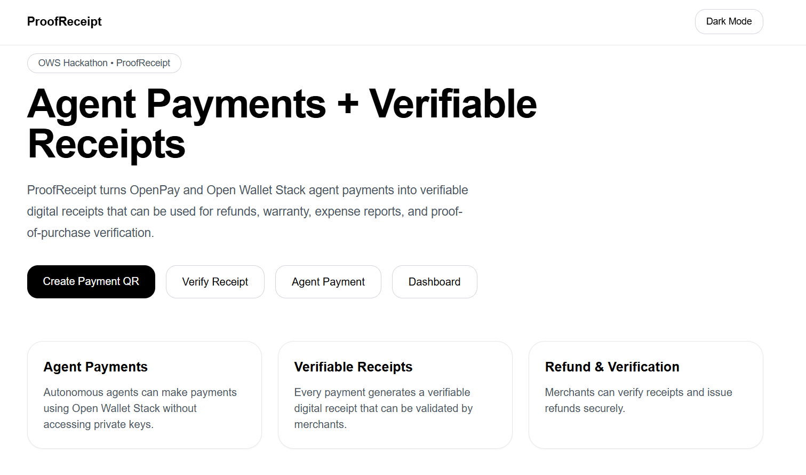
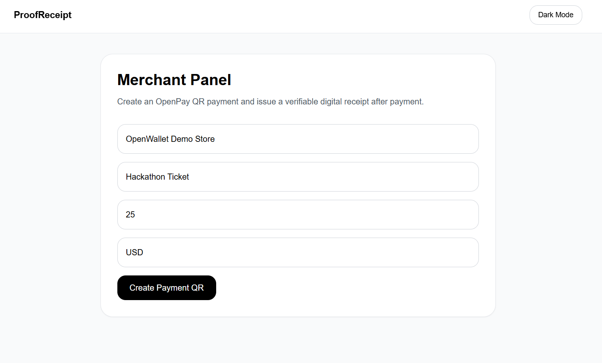
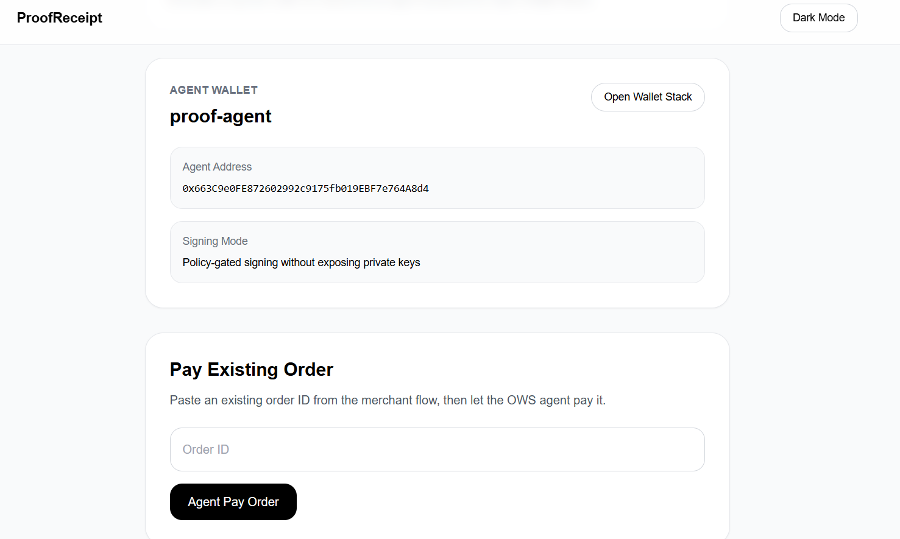
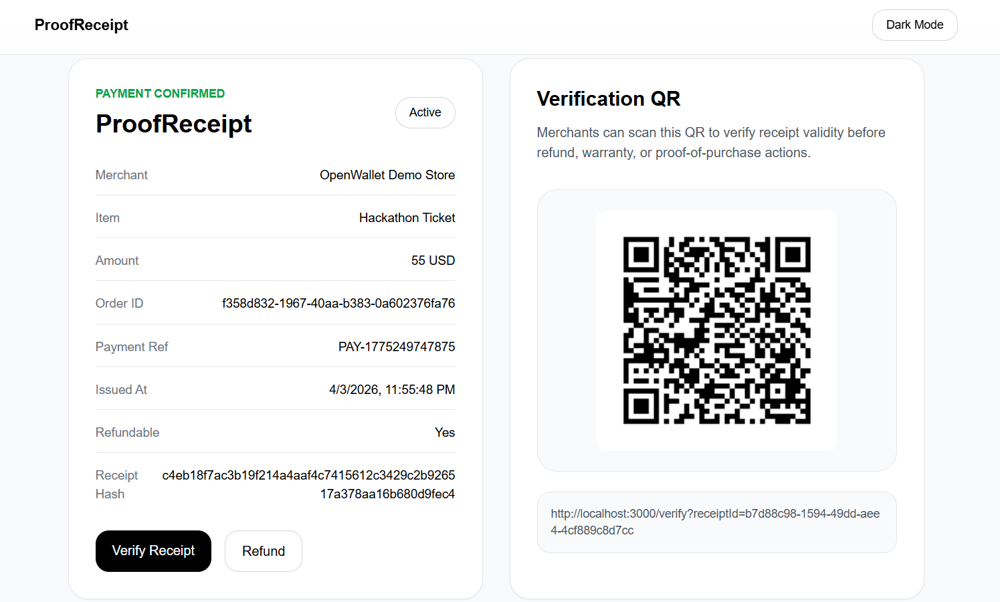
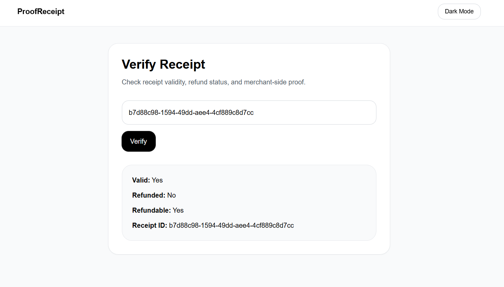
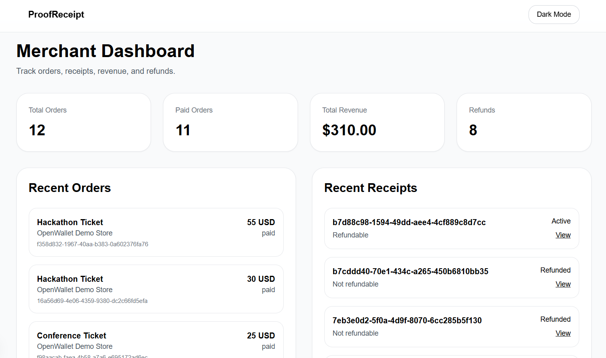

# ProofReceipt

**Agent Payments + Verifiable Digital Receipts using Open Wallet Stack**

ProofReceipt is a post-payment trust layer built on top of OpenPay QR and Open Wallet Stack (OWS).
It turns every payment — including agent-based payments — into a verifiable digital receipt that can be used for refunds, warranty claims, expense reports, and proof-of-purchase verification.

Built for the Open Wallet Stack Hackathon.

---

## Problem

QR payments and agent payments solve checkout, but they do not solve what happens after checkout:

* How do you prove you paid?
* How does a merchant verify a refund request?
* How do you handle warranty claims?
* How do you submit expense proofs?
* How do you prevent refund fraud?

Receipts are usually screenshots, emails, or paper slips that are easy to lose or fake.

---

## Solution

ProofReceipt turns every payment into a **verifiable digital receipt**.

After a payment is completed:

1. A digital receipt credential is issued.
2. The receipt contains merchant, item, amount, timestamp, and payment reference.
3. The receipt has a hash and can be verified.
4. Merchants can verify the receipt before issuing refunds.
5. Refunds can be issued directly from the receipt.
6. Receipts can be used as proof of purchase or expense proof.

---

## Open Wallet Stack Integration

ProofReceipt integrates Open Wallet Stack to enable **agent-based payments without exposing private keys**.

An autonomous agent wallet executes payments using OWS.
After each agent payment, a verifiable digital receipt is issued and can be used for refunds and proof-of-purchase verification.

This demonstrates how OWS can be used for:

* Agent commerce
* Automated payments
* Merchant verification
* Post-payment workflows
* Refund validation

---

## Features

* Create QR payment
* Agent-based payment (OWS)
* Digital receipt generation
* Receipt verification page
* Refund flow
* Receipt verification QR
* Merchant dashboard
* Revenue and order tracking
* Dark mode / Light mode UI
* Supabase database
* Next.js App Router

---

## Demo Flow

1. Merchant creates payment QR
2. Order is created
3. Agent pays the order using Open Wallet Stack
4. Receipt is generated
5. Merchant verifies receipt
6. Refund is issued if needed
7. Dashboard shows revenue, orders, receipts

---

## Pages

| Page       | Description             |
| ---------- | ----------------------- |
| /          | Landing page            |
| /merchant  | Create payment QR       |
| /pay       | Simulate payment        |
| /agent     | Agent payment using OWS |
| /receipt   | Digital receipt         |
| /verify    | Verify receipt          |
| /refund    | Refund receipt          |
| /dashboard | Merchant dashboard      |

---

## Tech Stack

* Next.js
* TypeScript
* Tailwind CSS
* Supabase (Postgres)
* Open Wallet Stack (OWS)
* QR Code generation

---

## Local Development

Install dependencies:

```
npm install
npm run dev
```

Create a `.env.local` file:

```
NEXT_PUBLIC_SUPABASE_URL=your_supabase_url
NEXT_PUBLIC_SUPABASE_ANON_KEY=your_supabase_anon_key
SUPABASE_SERVICE_ROLE_KEY=your_supabase_service_role_key
NEXT_PUBLIC_APP_URL=http://localhost:3000

OWS_AGENT_NAME=proof-agent
OWS_AGENT_ADDRESS=your_agent_address
```

---

## Why This Matters

ProofReceipt adds a **post-payment trust layer** to agent payments and QR payments.

This can be used for:

* Refund verification
* Warranty claims
* Expense reports
* Event tickets
* Proof of purchase
* Access control
* Merchant analytics
* Fraud reduction
* Agent commerce systems

---

## Future Improvements

* Real OpenPay integration
* Real blockchain transactions via OWS
* Wallet credential / VC receipts
* Receipt PDF export
* Email receipts
* Multi-merchant support
* Analytics charts
* Mobile app
* Event ticket mode
* Warranty tracking

---

## Screenshots

### Landing


### Merchant


### Agent Payment


### Receipt


### Verify


### Dashboard


---

## License

MIT
